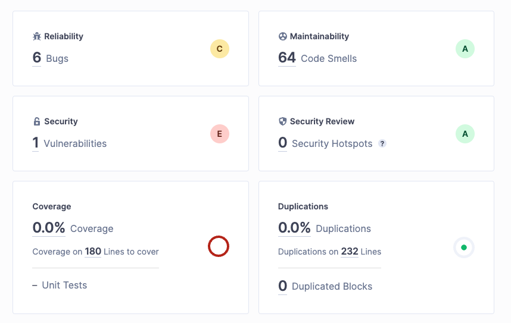

# Portfolio Ontwikkelstraten

[GitHub](https://github.com/semvis123/ows)
// TODO:
- [ ] Add a git bundle of the repo

## Week 1

## Week 2

## Week 3
## jenkins

### Branching strategy
Gekozen voor Github flow.

- Alles op de master branch is altijd deployable
- Branches worden gemaakt voor nieuwe features en bug fixes
- CD kan direct worden toegepast op de master branch
- Pull requests worden gebruikt om code te reviewen en te testen voordat het wordt gemerged naar de master branch

## Week 4
<!-- Pas de pipeline in Jenkins aan zodat deze ook SonarQube gebruikt om de kwaliteit van de code
te controleren. Maak een rapport met SonarQube en beschrijf aan de hand hiervan de
kwaliteitsproblemen in de gegeven code en mogelijke oplossingen daarvoor. Beargumenteer 
je oplossingen. Pas de gegeven code aan zodat deze kwalitaGef beter wordt, zowel op
microniveau (de individuele regels code) als op macroniveau (de verdeling van code over
verschillende modules).
Bewijsmiddelen: De aangepaste Jenkinsfile, de uitvoer van SonarQube en een PDF of Worddocument met de geconstateerde kwaliteitsproblemen en de mogelijke oplossingen. De
verbeterde code dient onderdeel te zijn van de ingeleverde repository. -->
### SonarQube

Uit de SonarQube analyse komen de volgende problemen naar voren:
- Op veel plekken is de code niet makkelijk leesbaar, wat de onderhoudbaarheid van de code verlaagd en de kans op bugs verhoogd.
- Database heeft geen wachtwoord
- Er zijn geen tests

#### Oplossingen
- De code is formatted zodat deze makkelijker leesbaar is
- Er is een wachtwoord toegevoegd aan de database doormiddel van een environment variabele
- Unit tests worden toegevoegd in de volgende weken
- De game logica is verplaatst naar een game class, zodat er niet op allerlei plekken state wordt veranderd

# Week 5
<!-- Week 5
Los bugs 1 tot en met 4 in de codebase op. Schrijf ook unit tests om te voorkomen dat deze
bugs later weer optreden.
Bewijsmiddelen: De unit tests en aangepaste code dienen onderdeel te zijn van de
ingeleverde repository.
-->
Zie game.test.php voor de unit tests.

# Week 6
<!--
Week 6
Implementeer features 1 tot en met 5. Gebruik hiervoor test-driven development.
Bewijsmiddelen: De unit tests en aangepaste code dienen onderdeel te zijn van de
ingeleverde repository.
-->
Klaar, zie repo.

# Week 7

Zie repo.

<!--
Week 7
Implementeer feature 6. Gebruik hiervoor test-driven development en test doubles. Schrijf
ook een Dockerfile om de voor deze feature benodigde container te configureren. Los
daarnaast bug 5 op. Schrijf hierbij unit tests met test doubles om te voorkomen dat deze bugs
later weer optreden.
Bewijsmiddelen: De Dockerfile en andere benodigde configuraGebestanden voor de
containerconfiguraGe en screenshots van de werkende containeromgeving -->
